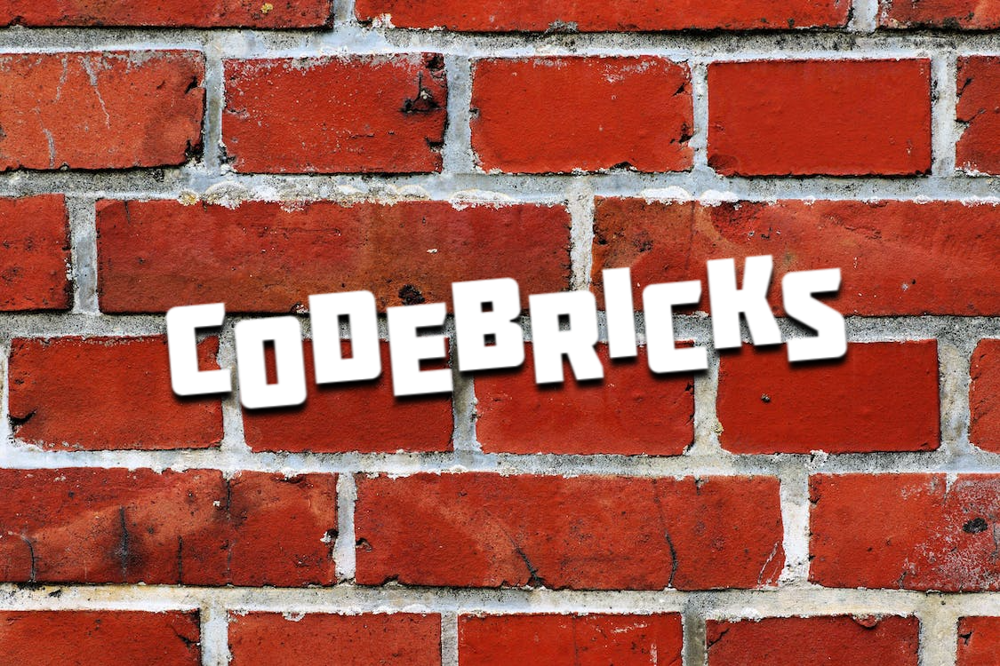
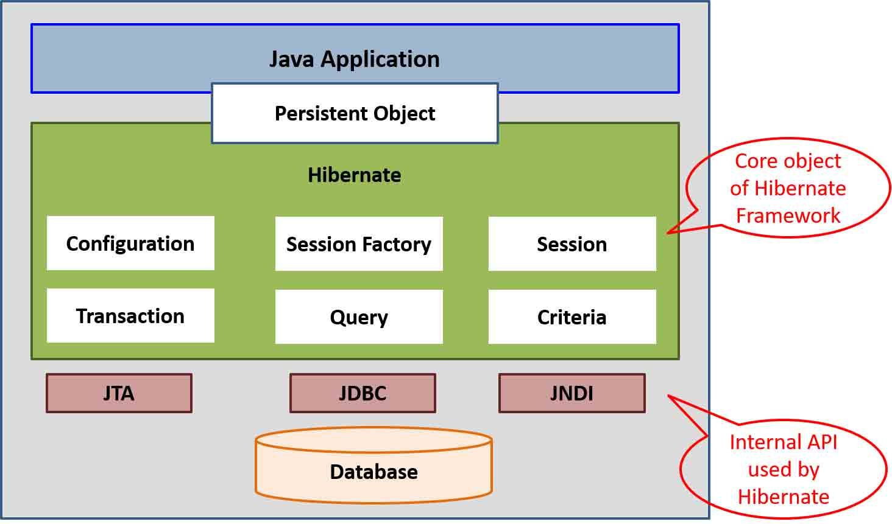

<!-- Improved compatibility of back to top link: See: https://github.com/othneildrew/Best-README-Template/pull/73 -->
<a name="readme-top"></a>

<p align="center">
  
</p>

<br>

<p align="center">
  
  
</p>

<br>

```java
String hql = "FROM Employee E WHERE E.id > 10 ORDER BY E.salary DESC";
```

# Spring
## JPA, Hibernate and Spring Data JPA
### JPA
<p>
  JPA stands for Java Persistence API. It's a specification to persist Java objects in relational Database. It cannot be used without an ORM implementation like Hibernate or EclipseLink. Hibernate is the de facto JPA     implementation standard.
</p>

<p>
  java. persistence package includes the JPA classes and interfaces. It provides:
  <ul>
    <li>
      JPA provides JPQL (Java Persistence Query Language). Hibernate's HQL is an extended version or a superset of JPQL. HQL is a query language that will be translated to plain SQL queries. It's syntax operates with objects and properties, instead of tables and columns. An example of HQL syntax: String hql = "FROM Employee E WHERE E.id > 10 ORDER BY E.salary DESC"
    </li>
    <li>For persisting mapped entities, JPA provides EntityManagerFactory interface, whereas Hibernate uses the SessionFactory. Note that JPA's EntityManager is only an interface, it's implemented by Hibernate.</li>
  </ul>
</p>

<p>So JPA provides some in-built stuff that is used by every kind of JPA implementations, hence if you change your ORM framework (let's say from Hibernate to EclipseLink) your code will not break. Hibernate specific functionality can be used only, if you are sure you don't want to replace it in the future.</p>

### Hibernate
<p>
  
</p>
<p>Hibernate is an ORM framework, a JPA implementation. Spring Boot uses Hibernate as the default JPA implementation. It uses JDBC to communicate with the Database. Before Hibernate, developers used JDBC directly to persist data, and mapped manually to the DTO objects. Using Hibernate, you can minimize the JDBC code you have to write. Hibernate maps the relational database table to a Java object. It provides HQL for writing queries using objects and properties instead of tables and columns.</p>

<p>
  Hibernate supports writing native queries as well, but it's not recommended, because if you change the database behind your app, your query can break. But if you uses HQL instead, Hibernate will translate it to new Database syntax, after you configurated the new database dialect.
</p>

### Spring Data JPA
Spring Data is part of Spring framework.

#### Spring Data generates DAOs
<p>
    Making your own DAO implementations are unneccessary, because Spring Data generates it for you.
    We only need to define DAO implementations
</p>

//TODO: innen folytatni ebből: https://www.baeldung.com/the-persistence-layer-with-spring-data-jpa

### FetchType.LAZY and FetchType.EAGER
<p>
    EAGER loading fetches all of the associations of entity at initialization time. So every entity related data
    will be fetched from the DB when the entity is instantiated.
</p>

```java
@Entity
@Table(name = "USER")
public class Author {

    @Id
    @GeneratedValue
    private Long id;

    @OneToMany(fetch = FetchType.EAGER, mappedBy = "user")
    private Set<Book> books = new HashSet();

}
```
<p>
    In contrast, you can see and example of LAZY loading below. The set of books written by the author will be queried against the DB not by the initialization of the entity,
    but when we call the getBooks() method.
</p>

```java
@Entity
@Table(name = "USER")
public class Author {

    @Id
    @GeneratedValue
    private Long id;

    @OneToMany(fetch = FetchType.LAZY, mappedBy = "user")
    private Set<Book> books = new HashSet();

}
```

#

## Stuff to allocate somewhere
FetchType recommendations:
To-many relationships
<ul>
  <li>Stick to the default mapping (FetchType.LAZY)</li>
  <li>Use eager fetching for specific queries, if required</li>
</ul>
To-one relationships
<ul>
  <li>check existing mappings individually</li>
  <li>Use FetchType.LAZY for new ones</li>
</ul>

<br>

### Stuff to allocate: Common problem: N+1 select
Lazy fetching of related entities.
Get the authors, then iterate through them, and fetch related books one by one. --> so every access to the book association generates a query.

### Stuff to allocate:Persistence layer
great stuff, for instance DTO Projections, and when to use them. https://www.youtube.com/watch?v=smyFi4OCHDE
Writing notes, and creating own sample codes for this.


